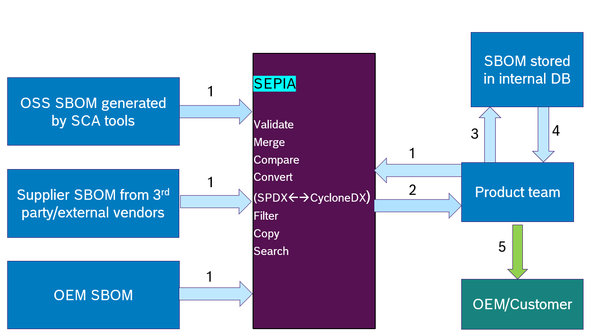
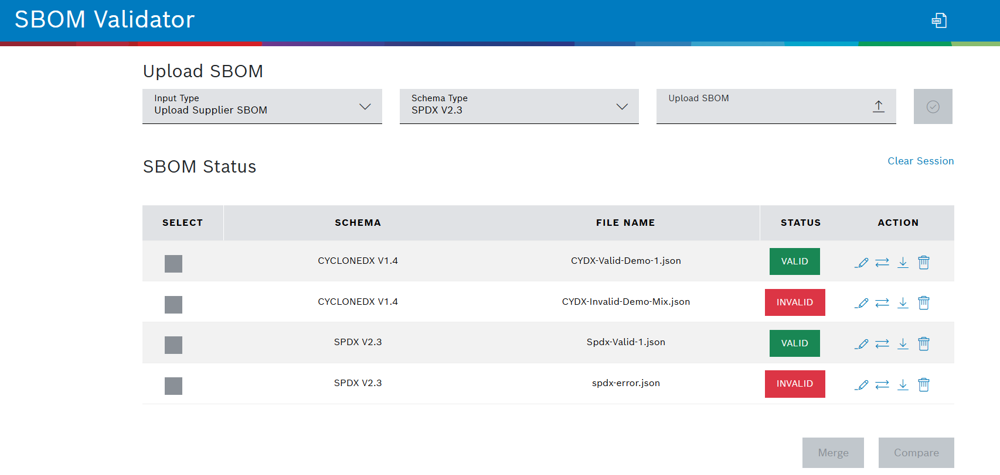

# SBOM-sg-SEPIA

The team at Bosch were working on a mapping of SPDX and CycloneDX on both property level (= syntax) and a semantic interpretation of the information. They wrote a schema that describes a bare minimum SBOM on semantic level, and a validator for this. This repo is to explore the work done.

# SEPIA – SBOM Exchange Procedures, Interfaces and Architecture

## Introduction 

SEPIA is a project which focuses on validating SBOMs by using standard SBOM schemas. 

Additionally, we would like to curate an Open SBOM schema library by collecting schemas used across industry.

It also provides a tooling which helps to validate SBOM schemas and perform operations such as Edit, Merge, Convert, Copy, Compare and Filter.

## License

SEPIA project is licensed under Creative Commons Attribution 4.0 International except for the source code.

Source code is licensed under MIT license.

SPDX license Identifiers : CC-BY-4.0 and MIT

## Challenges :

1. Currently we have many ways to document SBOMS

    *Competing Standards: SPDX + CycloneDX

    *Every Customer has at least one self-made SBOM format.

    *Legal requirements also often apply, depending on product and market.

    => Cost intensive activity that does not add real value to the end-user.

2. SPDX and CycloneDX have overlaps and unique attributes

    *Both have many versions that are not compatible.

    *Mapping is difficult as there is no "babel fish".

    *Merging is difficult as data might get lost.

    *Backward and forward compatibility is not always guaranteed.

    => automation with existing tools is not possible without gambling with your compliance.

## Our Approach : Make it Open Source

1.  We started an Open Source project.

    *We will provide our evaluation and mapping of SPDX and CycloneDX with semantic definition of important properties.

    *We will provide our SBOM tooling and will continue its development in the Open.

    *We will provide our semantic schema (currently SPDX only).

    *We will curate an Open SBOM Schema Library that can be used for automation.

2.  We encourage you to participate in this activity.

    *Providing your semantic schema to build an Open SBOM Schema Library.

    *Share your insights and experience to build an SBOM ecosystem that allows an automatic processing of SBOMs independent of the tool used to generate and the format used.

3.  We will use our experience and assets in the OpenChain activities to define a “common SBOM” –  through OpenChain SBOM Study Group.

## The Big Picture:

## Proposed Solution :

*Existing schemas were not sufficient and is the root cause of ambiguities.

*We defined SPDX and CycloneDX schema which reflects our requirements in a machine processible SBOM.

*The defined schema is used to validate the SBOM.

*SEPIA lists the syntactic errors which can be resolved using the edit feature of the tooling.

**Dashboard :** 

**Edit :** 

**Error log :**

## Status :

*Current features – Validate, Edit, Merge and Integration with SCA tool.

*In development – Convert (SPDX<-> CycloneDX) and rdf to json converter and dockerization.

*Future tool focus – Filter, copy and compare.

*Community focus – collect and distribute schema from other companies.

## Benefits :

*Ensure machine processable SBOM exchange with semantic relevance.

*Providing validator to suppliers that would ensure SBOM quality.

*Purchase teams could use validator for first check of deliveries from their suppliers.
    

