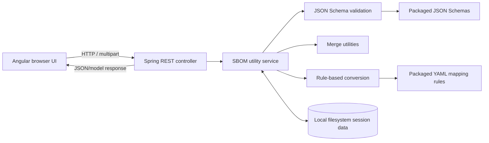

# SEPIA SBOM Tools: Technical Documentation

## 1. Purpose and Scope

This repository contains an SBOM validation and manipulation application, a collection of SEPIA and automotive JSON Schema profiles, and supporting documentation and scripts. The runnable application is split into an Angular browser UI and a Java/Spring Boot service. The backend validates SBOM JSON, persists per-session working files, supports editing and merging, and provides rule-driven conversion between SEPIA CycloneDX 1.6 and SPDX 2.3.

This document describes the implementation present in the repository.

## 2. Repository Layout

| Path | Responsibility |
|---|---|
| [`tools/sbom-public-service/`](tools/sbom-public-service/) | Spring Boot backend, Java source, packaged schemas and conversion rules, Maven build. |
| [`tools/sbom-public-ui/`](tools/sbom-public-ui/) | Angular UI, client-side models/schema definitions, sample BOMs and mapping data. |
| [`schema/`](schema/) | Published SEPIA and automotive schema profiles with companion human-readable field notes. |
| [`presentations/`](presentations/) | Project presentation material. |
| [`images/`](images/) | Screenshots and project workflow illustrations used by existing documentation. |
| [`docker-compose.yml`](docker-compose.yml) | Local two-container build/run configuration. |
| [`sbom-tools.ps1`](sbom-tools.ps1) | PowerShell multipart client for the backend's direct upload-and-validate endpoint. |
| [`.github/workflows/reuse.yml`](.github/workflows/reuse.yml) | REUSE compliance workflow. |
| [`README.md`](README.md), [`Documentation.md`](Documentation.md), [`Installation.md`](Installation.md) | Project overview, user workflow/API examples, and setup instructions.|

Generated Maven output under `tools/sbom-public-service/target/` is not source. It should not be edited as the authoritative implementation.

## 3. Runtime Architecture

The UI is a single-page Angular application. It calls the backend directly from the browser using a hard-coded `http://localhost:9051/` base URL. The backend has one primary REST controller, a service interface/implementation for SBOM operations, schema and conversion helpers, and filesystem-based persistence. No database is configured.



The Java entry point is [`SbomUtilsServiceApplication`](tools/sbom-public-service/src/main/java/org/openchainproject/sepia/SbomUtilsServiceApplication.java). Backend HTTP routes are declared in [`SbomUtilityController`](tools/sbom-public-service/src/main/java/org/openchainproject/sepia/controller/SbomUtilityController.java), with business operations implemented principally by [`SbomUtilityServiceImpl`](tools/sbom-public-service/src/main/java/org/openchainproject/sepia/service/impl/SbomUtilityServiceImpl.java). The main request/response model is [`BomFilesInputModel`](tools/sbom-public-service/src/main/java/org/openchainproject/sepia/model/BomFilesInputModel.java).

The Angular bootstrap is [`main.ts`](tools/sbom-public-ui/src/main.ts), which loads [`AppModule`](tools/sbom-public-ui/src/app/app.module.ts). The primary workflow is in [`SbomInputComponent`](tools/sbom-public-ui/src/app/sbom-input/sbom-input.component.ts), with API calls in [`SbomInputService`](tools/sbom-public-ui/src/app/services/sbom-input.service.ts) and endpoint constants in [`RestEndpointsService`](tools/sbom-public-ui/src/app/services/rest-endpoints.service.ts). Routing uses hash-based URLs: `#/` for SBOM input and `#/sbom-visualization` for the mapping visualizer.

### Main UI Workflows

1. **Upload and validate:** the UI creates a session identifier, uploads a file and metadata, then requests validation. It displays validity and returned errors; invalid content can be edited and saved for revalidation.
2. **Edit and download:** the UI requests JSON content, computes change information through backend endpoints, and can request report data before downloading. The editor/download path handles JSON; report packaging can include generated PDF reports and a ZIP.
3. **Merge:** users select valid entries of one schema type, provide format-specific root metadata, and submit to a CycloneDX or SPDX merge endpoint.
4. **Convert:** the UI permits conversion for SEPIA SPDX 2.3 and SEPIA CycloneDX 1.6 entries, asks for confirmation, and calls the backend conversion endpoint.
5. **Explore mappings:** the visualizer loads bundled sample BOMs and mapping data and presents field relationships. It is an explorer over included sample resources; its component's conversion helpers are not the backend conversion pipeline.

UI route and workflow details are implemented in [`app-routing.module.ts`](tools/sbom-public-ui/src/app/app-routing.module.ts), [`sbom-input.component.ts`](tools/sbom-public-ui/src/app/sbom-input/sbom-input.component.ts), and [`sbom-visualization.component.ts`](tools/sbom-public-ui/src/app/sbom-visualization/sbom-visualization.component.ts). The visualizer loads files from [`src/resources/`](tools/sbom-public-ui/src/resources/).

## 4. Backend API

There is no controller-level URL prefix. Unless noted, POST requests use JSON serialized inside a multipart or form field named `postData`, rather than a conventional JSON request body. File-related routes consume `multipart/form-data`. The backend often returns model status/message fields instead of setting matching HTTP error status codes; `/health` is the clear exception and uses `ResponseEntity`.

| Method and path | Inputs | Implementation behavior |
|---|---|---|
| `GET /health` | Optional `iv-user` header | Returns status text `Server is running` and the header value as `userId` (or null). This is a liveness response, not authentication. |
| `POST /uploadInputFile` | Multipart `file[]` and `postData` | Checks declared schema/type against file markers, saves uploaded entry data, and runs the service workflow. |
| `POST /validateSboms` | Multipart request and `postData` | Validates uploaded/stored SBOMs; caught failures are represented in the returned model, including a model status of 500 in the controller's catch path. |
| `POST /deleteSbomEntry` | `postData` | Requests deletion of one session entry directory. |
| `POST /clearSession` | `postData` | Requests deletion of the session directory; returns no response body. |
| `POST /fetchErrorDetails` | `postData` | Loads stored validation error details when present. |
| `POST /fetchJsonContent` | `postData` | Loads JSON content from an entry directory. |
| `POST /mergeCyclonedx` | `postData` list, `bomMetadata`, optional `isFromApp` | Merges CycloneDX entries. The merged JSON string is omitted unless `isFromApp` is true. |
| `POST /mergeSpdx` | `postData` list, `bomMetadata`, optional `isFromApp` | Merges SPDX entries with the same response convention. |
| `POST /convertSbom` | `postData`, optional `isFromApp` | Dispatches conversion based on schema type and validates the target output. |
| `POST /replaceFile` | `postData` | Persists replacement JSON and revalidates it. |
| `POST /getJsonDifferences` | `currentValue`, `postData`, `isMerge` | Returns a list of `ChangeLog` differences. Failures are logged and return the current (possibly empty) list. |
| `POST /prepareForDownload` | `currentValue`, `postData` | Computes validation, SHA-512 hash and change-log data for proposed content; does not persist that edited content. |
| `POST /uploadAndValidate` | Multipart `file[]` and `postData` | Direct upload-and-validate API used by the PowerShell helper. The response omits internal schema, file path, validation-state and status fields. |
| `GET /downloadUserManual` | None | Streams the classpath PDF as an octet-stream attachment. |
| `POST /customValidate` | Multipart `file[]`, `schemaFile[]` and `postData` | Validates an uploaded SBOM against an uploaded schema; response omits internal schema JSON. |
| `POST /validateAndConvert` | Multipart single `file` and `postData` | Validates the source, converts it, validates the output, and returns converted JSON as `sbomJson` while removing internal fields. |
| `POST /validateAndMerge` | Multipart `file[]`, optional `manifestFile[]`, and `postData` | Direct multi-file merge API; returns a `response` array and operation message after removing uploaded-file and internal JSON/path data. |

The exact DTO fields vary by operation and schema; inspect [`BomFilesInputModel`](tools/sbom-public-service/src/main/java/org/openchainproject/sepia/model/BomFilesInputModel.java), controller parameter annotations, and the corresponding service method before adding a client. `postData` commonly carries schema type/version, session ID or timestamp, entry index, file name, and operation state.

The UI uses the staged endpoints (`/uploadInputFile`, `/validateSboms`, etc.). `/uploadAndValidate`, `/customValidate`, `/validateAndConvert`, and `/validateAndMerge` are additional direct API routes and are not the same client flow.

## 5. Validation, Schemas, and Data Operations

### Validation

The service selects packaged schemas by schema type and validates JSON using NetworkNT JSON Schema Validator. Supported schema draft handling for custom schemas includes Draft 7, 2019-09, and 2020-12. Standard SPDX/CycloneDX validation includes additional duplicate identifier checks for SPDX `SPDXID` and CycloneDX `bom-ref`; those same extra checks are not applied identically to custom and SEPIA/CDQ paths. Validation failures are recorded as error details and serialized to `error_log.txt`; successful validation creates `success_log.txt`.

Packaged backend schema resources include standard SPDX 2.2/2.3 and CycloneDX 1.4 definitions, SEPIA/CDQ SPDX 2.3 and CycloneDX 1.6 definitions, automotive profiles, and referenced external definitions. The repository-level schema library has these profiles:

| Profile | Repository schema |
|---|---|
| SEPIA CycloneDX 1.4 | [`schema/sepia/cyclonedx/sepia_cyclonedx_1.4.schema.json`](schema/sepia/cyclonedx/sepia_cyclonedx_1.4.schema.json) |
| SEPIA CycloneDX 1.6 | [`schema/sepia/cyclonedx/sepia_cyclonedx_1.6.schema.json`](schema/sepia/cyclonedx/sepia_cyclonedx_1.6.schema.json) |
| SEPIA SPDX 2.3 | [`schema/sepia/spdx/sepia_spdx_2.3.schema.json`](schema/sepia/spdx/sepia_spdx_2.3.schema.json) |
| Automotive CycloneDX 1.6 | [`schema/automotive/cyclonedx/automotive_cyclonedx_1.6.json`](schema/automotive/cyclonedx/automotive_cyclonedx_1.6.json) |
| Automotive SPDX 2.3 | [`schema/automotive/spdx/automotive_spdx_2.3.schema.json`](schema/automotive/spdx/automotive_spdx_2.3.schema.json) |

Each profile has adjacent Markdown field notes. The repository-level schema files and runtime-packaged schema files are separate copies; schema changes should be checked for parity. The UI also embeds TypeScript schema definitions under [`tools/sbom-public-ui/src/app/schema/`](tools/sbom-public-ui/src/app/schema/). The root `schema/` directory is not mounted into either Compose container.

### Merge

CycloneDX merging is implemented in [`SbomMergeUtil`](tools/sbom-public-service/src/main/java/org/openchainproject/sepia/util/SbomMergeUtil.java) using the CycloneDX library. The implementation generates a new document identity, combines components and associated structures, resolves duplicate references, and records changes. Its SEPIA CycloneDX 1.6 path handles additional structures including annotations, formulation, declarations, definitions, and properties.

SPDX merging combines packages, files, snippets, annotations, external document references, extracted licensing information, and relationships, remapping duplicate identifiers/references. Optional manifests are deserialized to typed models and validated; CycloneDX manifest license IDs are checked against IDs from packaged CycloneDX schemas. The UI performs client-side required-field checks for merge metadata in [`validation.util.ts`](tools/sbom-public-ui/src/app/utils/validation.util.ts); actual merge construction and validation are backend responsibilities.

### Conversion

Conversion is a separate YAML-rule pipeline: [`ConversionService`](tools/sbom-public-service/src/main/java/org/openchainproject/sepia/service/ConversionService.java) loads and validates mappings through [`YamlRuleRepository`](tools/sbom-public-service/src/main/java/org/openchainproject/sepia/rule/YamlRuleRepository.java), then invokes [`RuleEngine`](tools/sbom-public-service/src/main/java/org/openchainproject/sepia/service/RuleEngine.java). Packaged rule pairs cover only CycloneDX 1.6 to SPDX 2.3 and SPDX 2.3 to CycloneDX 1.6. Transform implementations are under [`transform/`](tools/sbom-public-service/src/main/java/org/openchainproject/sepia/transform/), with loss policies/events and conversion-delta analysis used to report data that is lost, modified, or added. The multipart `/validateAndConvert` route validates the source before conversion; `/convertSbom` does not perform that same source-validation step before conversion, but validates output.

### Rule format specified in the .yaml file
   ```bash
  - ruleId: MAN-SUPPLIER-CREATOR-ORG-001
    description: ‘BOM supplier organization becomes an Organization creator.'
    sourcePath: metadata.supplier.name
    targetPath: creationInfo.creators[]
    cardinality: one-to-one
    transform:
      function: template
      args: {format: "Organization: {value}“}
    onAbsent: annotate
    onUnmappable: annotate
    severityIfLost: MAJOR
    authority: spec
    prohibitFabrication: true
    xbucket: native
    xfieldsCovered: 1
```

# Rule Description Reference

This table documents the properties used to define and process conversion rules.

| Property | Purpose | Allowed values | Consumed by |
|---|---|---|---|
| `ruleId` | Unique identifier; the audit key stamped on every loss event. | `MAN-*` / `OPT-*` string | RuleValidator, PolicyEngine, TransformContext |
| `description` | Human rationale for the mapping decision. | Text | Reviewers only |
| `sourcePath` | Input JSON path(s). | Path / list of paths / `null` | RuleEngine, ConversionDeltaAnalyzer |
| `targetPath` | Output JSON path(s). `null` marks a pure-loss rule. | Path / list / `null` | RuleEngine, ConversionDeltaAnalyzer |
| `cardinality` | Shape of the mapping. | `one-to-one`, `one-to-many`, `many-to-one`, `none` | RuleValidator |
| `transform.function` | Which transform to apply. | `Identity`, `join`, `template`, `enumMap`, `firstOnly`, `normalizeToSingleLine`, `constant`, `prefixStrip`, `idNormalize`, `uuidExtract` | RuleValidator, TransformRegistry, RuleEngine |
| `transform.args` | Transform parameters. | Not specified | TransformRegistry, transforms |
| `onAbsent` | Action when `sourcePath` yields nothing. | `drop`: silently ignores.<br>`Annotate`: records a `DROPPED` loss event with reason "Source value is absent".<br>`fail`: aborts the whole conversion with a `ConversionException`. | PolicyEngine, RuleValidator |
| `onUnmappable` | Action when a value exists but cannot be converted. | `drop`: silently ignores.<br>`Annotate`: records a `DROPPED` loss event with a reason.<br>`fail`: aborts the whole conversion with a `ConversionException`. | PolicyEngine, RuleValidator |
| `severityIfLost` | Business impact stamped on the loss event. | `BLOCKER`, `MAJOR`, `MINOR`, `INFORMATIONAL` | PolicyEngine, TransformContext |
| `authority` | Provenance of the decision. | `spec`, `house-policy` | Reviewers only |
| `lossReason` | Explanation written into the loss report for lost data. | Text | PolicyEngine, ConversionDeltaAnalyzer |
| `prohibitFabrication` | Restricts the use of assumed or inferred values; `true` is illegal with `constant`. | `true`, `false` | RuleValidator |
| `xbucket` | Classifies the conversion outcome of the rule. | `Native`: clean mapping to a first-class target field.<br>`Degraded`: preserved, but only as free text / a namespaced property.<br>`Fabricated`: value invented to satisfy a target-mandatory field.<br>`Lost`: no representation; recorded with a `lossReason`. | Metrics / reporting |
| `xfieldsCovered` | Count of source leaf fields the rule accounts for. | Integer | Coverage accounting |
| `xsplitGroup` | Links rules produced by splitting one logical rule. | -  | Reviewers only |


## 6. Data Model, Sessions, and Persistence

The backend uses local filesystem directories, not a relational or document database. The service derives entry paths from the configured upload root and request session, index, and schema type. It stores uploaded input and, as applicable, schema copies, validation logs and edited content. Entry deletion and session clearing recursively remove directories.

`BomFilesInputModel` transports session/file metadata, schema type/version, validation status/errors, JSON/schema content, hashes, change logs, messages and conversion loss/delta data. `ErrorModel` carries an error key/message and optional path; `ChangeLog` represents changed paths/values and operations. Uploaded multipart content is excluded from JSON serialization. There are additional manifest, SPDX, CycloneDX, and auth-related transport models; an active authentication mechanism is not identified in the codebase.

The Angular client keeps its session token and audit actions in browser `sessionStorage`. The backend does not use a database for that state. The backend's `iv-user` health header is echoed as a user ID; the source does not show identity verification or access control based on it.

`prepareForDownload` computes data for a proposed edited value without saving that value. Saving edits uses `replaceFile`, which writes the content and revalidates. `getJsonDifferences` uses JSON Patch comparison against stored original content or supplied content.

## 7. Configuration

| Setting | Checked-in value/behavior | Operational note |
|---|---|---|
| Backend HTTP port | `server.port: 9051` in [`application.yml`](tools/sbom-public-service/src/main/resources/application.yml) | The UI also calls port 9051. |
| SSL | Disabled in `application.yml` | No TLS termination configuration is provided in the application files. |
| Upload root | `sbom.upload.path=` in [`application.properties`](tools/sbom-public-service/src/main/resources/application.properties) | Blank outside an override; set it to a writable, controlled directory before running manually. |
| Input root | `sbom.input.path=` | Blank; purpose/override in a deployment is not identified in the codebase. |
| Multipart size | YAML says 150 MB/file and 200 MB/request; properties say 100 MB/file and request and set Tomcat form-post max to 100 MB | Spring Boot properties take precedence over YAML for duplicate keys at the same priority, so expect the 100 MB values unless overridden. Verify with the actual runtime environment. |
| Conversion rules | `classpath:/rules` | Rule files are packaged in backend resources. |
| Proxy | `proxy.url=` and `proxy.port=` | Blank by default. |
| CORS | Controller allows origin `*` and header `*` | This is permissive and is not authentication. Restrict for deployments that require a trusted-origin boundary. |
| UI backend URL | Hard-coded `http://localhost:9053/` in [`rest-endpoints.service.ts`](tools/sbom-public-ui/src/app/services/rest-endpoints.service.ts) | There is no environment-based URL or Angular proxy configuration. A browser user must be able to resolve/reach that host. |
| Docker upload directory | Backend image sets `SBOM_UPLOAD_PATH=/data/sbom`; Compose mounts `./data/sbom:/data/sbom` | This persists upload data in the host project directory. Apply appropriate permissions, retention and cleanup. |

The Java service uses SLF4J logging in the controller/service layers; some license-related logic writes directly to standard output. There is no centralized exception advice. Exceptions are generally logged and translated to model messages, JSON error objects, or empty results; some responses include exception text. API consumers should inspect both transport-level status and response-body fields.

Custom-schema validation may resolve external schema references. The service contains timeout/redirect limits and classpath fallbacks for known definitions, but no host allowlist was identified.

## 8. Build, Run, and Test

### Prerequisites from Build Configuration

- Java 17 and Maven (the backend includes the Maven Wrapper).
- Node.js 20 is used by the UI Dockerfile; the project is Angular 17.3 with TypeScript 5.4 and npm dependencies.
- Docker Compose is optional for local container startup.


### Backend

From `tools/sbom-public-service`:

```powershell
\.\mvnw.cmd clean package -DskipTests
\.\mvnw.cmd spring-boot:run "-Dspring-boot.run.arguments=--sbom.upload.path=C:\\temp\\sbom"
```

Alternatively, set `SBOM_UPLOAD_PATH` as a Spring relaxed-binding environment variable or supply `--sbom.upload.path=<writable-directory>` to the application. To run the packaged JAR, build it and execute `java -jar target/sbom-utils-service-2.0.jar --sbom.upload.path=<writable-directory>`.


### Frontend

From `tools/sbom-public-ui`:

```powershell
npm ci
npm start
npm run build
npm test -- --watch=false
```

The UI dev server defaults to port 4200. The test target uses Karma/Jasmine and six checked-in spec files. The Angular production build is the default build configuration and emits to `dist/sbom-utils-ui`.

### Containers

The backend Dockerfile builds with Maven and Java 17, skips tests, and runs the packaged JAR. The UI Dockerfile runs `ng serve` from Node 20; it is a development-server container, not a production static web-server image.   
The current Compose backend mapping is `9051:9051`.

## 9. Existing Documentation and Product Claims

[`README.md`](README.md) provides project motivation and a high-level feature/status description. [`Documentation.md`](Documentation.md) describes upload, merge and direct API usage. [`Installation.md`](Installation.md) provides manual setup steps.
