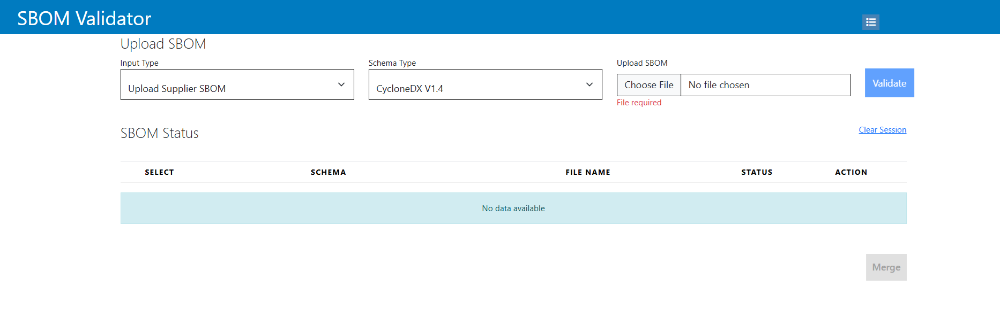

<!-- SPDX-FileCopyrightText: Copyright (C) 2025 Contributors to SEPIA

SPDX-License-Identifier: CC-BY-4.0 -->
## **SBOM Validator**

**SBOM Validator** is a comprehensive tool designed for managing and
streamlining Software Bill of Materials (SBOM) files. It supports
operations such as **validation**, **editing**, **merging**,
**comparison**, and **conversion** of SBOMs in JSON formats like
**CycloneDX 1.4** and **SPDX 2.3**.

Developed using **Java Spring Boot** (backend) and **Angular**
(frontend), SBOM Validator ensures compliance with industry standards
while enhancing interoperability and efficiency in managing SBOMs.

## Technologies

     Microservices        npm
     TypeScript           Apache Maven  
     ANGULAR              Docker
     SpringBoot           swagger
                   
              

## Key Features

-   **Validation**: Ensure SBOM files conform to CycloneDX and SPDX
    standards.

-   **Editing**: Modify SBOM entries, including components and
    dependencies.

-   **Merging**: Combine multiple SBOM files into a single, unified
    document.

With its intuitive interface and robust functionality, SBOM Validator
simplifies SBOM management, ensuring software supply chain transparency,
compliance, and security.

## User Interface

The user can upload and validate the SBOM files and perform the merge operation.
The session will clear all the uploaded file once reload the page.
Download and keep Audit Log for future reference.

